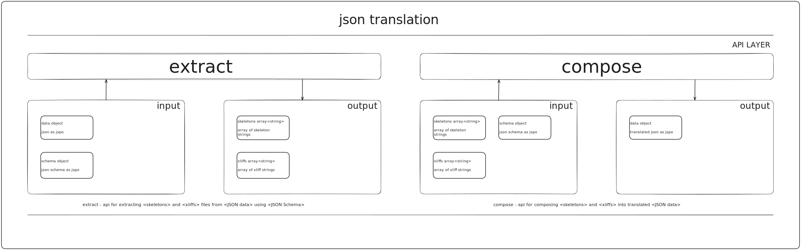

# json-translation

## 📚 Sections

- [👋 Introduction](#-introduction)

- [🌟 Project Overview](#-project-overview)

- [🎯 Purpose and Scope](#-purpose-and-scope)

- [🚀 Getting Started](#-getting-started)

- [💻 Installation](#-installation)

- [📖 API](#-api)

- [💡 Usage](#-usage)

- [🧠 Architecture](#-architecture)

## 👋 Introduction

Hey, There!

This library helps you to translate your json data that is structured with json schema.

In the end you will be able to easily generate XLF and skeleton files for CATs from your json, and compose XLF and skeleton into translated json.

Library supports Markdown syntax inside translatable strings, by heavily relying on [markdown-translation](https://github.com/diplodoc-platform/markdown-translation) library.

## 🌟 Project Overview

This library provides two API interfaces extract and compose.

Extract strings from json fields marked as translatable in the json schema and generate skeleton and XLF files.

Compose translated XLF and skeleton into translated json.

Say goodbye to manual editing work and streamline your workflow with json-translation.

## 🎯 Purpose and Scope

🤯 This library is tackling some serious problems with json translations!

🚫 Say goodbye to unnecessary heavy load on translators caused by naive approaches that include markdown syntax constructs into text segments.

💥 "collisions" - yikes! But fear not, this library has got your back with a reliable solution for extracting/composing translatable markdown from json data.

🕵️‍♀️ How? By combining power of parsers and custom renderers!

🧑‍💻 Say goodbye to those problems and hello to efficient and accurate translations with json-translation!

## 🚀 Getting Started

### 💻 Installation

```
npm install @diplodoc/json-translation
```

### 📖 API

#### 🔍 extract ✨

#### 🔤 compose ✨

### 👨‍💻 Usage

#### 🔍 Extract

#### 🔤 Compose

## 🧠 Architecture


